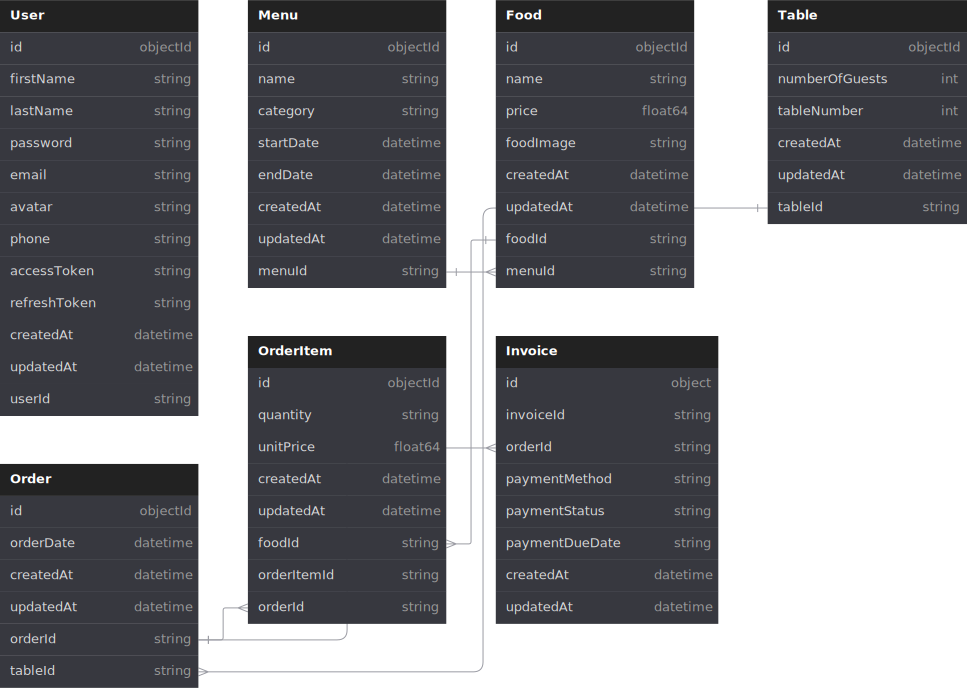

# Go Restaurant Management Backend Project

## Overview

This project is a simple backend solution for restaurant management, built using Go. It leverages the Gin framework for web handling, MongoDB for database operations, and includes essential functionalities such as user authentication (signup, login), and CRUD operations for menu items, food, tables, orders, order items, and invoices. Key packages used include Gin for routing, Validator for input validation, and JWT for secure authentication.

## Features

-   **Authentication:**

    -   Signup
    -   Login
    -   User retrieval

-   **Menu Management:**

    -   Create, Read, Update, Delete (CRUD) operations for menu items

-   **Food Management:**

    -   CRUD operations for food items

-   **Table Management:**

    -   CRUD operations for tables

-   **Order Management:**

    -   CRUD operations for orders

-   **Order Items Management:**

    -   CRUD operations for order items

-   **Invoice Management:**
    -   CRUD operations for invoices

## Technology Stack

-   **Go Version:** [Go](https://go.dev/) v1.23.1
-   **Web Framework:** [Gin](https://github.com/gin-gonic/gin) v1.10.0
-   **Input Validation:** [Validator](https://github.com/go-playground/validator) v10.20.0
-   **Database Driver:** [MongoDB Driver](https://github.com/mongodb/mongo-go-driver) v1.16.1
-   **Logging:** [Zap](https://github.com/uber-go/zap) v1.27.0
-   **Cryptography:** [Go Crypto](https://pkg.go.dev/golang.org/x/crypto) v0.23.0
-   **JWT:** [JWT Go](https://github.com/dgrijalva/jwt-go)

## API Endpoints

### Health

-   GET `/health/router` - Get the health status of gin/gonic router
-   GET `/health/database` - Get the health status of the mongodb database

### User Authentication

-   POST `/api/v1/users/signup` - User registration (signup)
-   POST `/api/v1/users/login` - User authentication (login)
-   GET `/api/v1/users/{userId}` - Get use by user id
-   GET `/api/v1/users` - Get all the registered users

### Menu

-   POST `/api/v1/menus` - Create a new menu
-   GET `/api/v1/menus` - Get all the menus
-   GET `/api/v1/menus/{userId}` - Get menu by id
-   PATCH `/api/v1/menus/{userId}` - Update the menu by id

### Food

-   POST `/api/v1/foods` - Create a new food item
-   GET `/api/v1/foods` - Get all the food items
-   GET `/api/v1/foods/{userId}` - Get food item by id
-   PATCH `/api/v1/foods/{userId}` - Update the food item by id

### Table

-   POST `/api/v1/tables` - Create a new table
-   GET `/api/v1/tables` - Get all the tables
-   GET `/api/v1/tables/{tableId}` - Get table by id
-   PATCH `/api/v1/tables/{tableId}` - Update the table by id

### Order

-   POST `/api/v1/orders` - Create a new order
-   GET `/api/v1/orders` - Get all the orders
-   GET `/api/v1/orders/{orderId}` - Get order by id
-   PATCH `/api/v1/orders/{orderId}` - Update the order by id

### OrderItem

-   POST `/api/v1/orderItems` - Create a new orderItem
-   GET `/api/v1/orderItems` - Get all the orderItems
-   GET `/api/v1/orderItems/order/{orderId}` - Get all orderItems for an order
-   GET `/api/v1/orderItems/{orderItemId}` - Get orderItem by id
-   PATCH `/api/v1/orderItems/{orderItemId}` - Update the orderItem by id

### Invoice

-   POST `/api/v1/invoices` - Create a new invoice
-   GET `/api/v1/invoices` - Get all the invoices
-   GET `/api/v1/invoices/{invoiceId}` - Get invoice by id
-   PATCH `/api/v1/invoices/{invoiceId}` - Update the invoice by id

## Database Architecture Diagram

